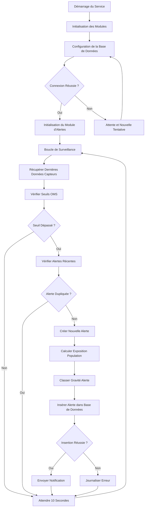

# BPMN - Service Alertes

## Diagramme BPMN

## Description des Activités

### 1. Initialisation du Service
- **Configuration de la Base de Données**:
  - Connexion à PostgreSQL pour le stockage des alertes
  - Vérification de l'état de la connexion
  
- **Initialisation du Module d'Alertes**:
  - Chargement des seuils OMS
  - Configuration des paramètres de déduplication
  - Initialisation du système de notification

### 2. Boucle de Surveillance Principale
- **Récupérer Dernières Données Capteurs**:
  - Requête à TimescaleDB pour les dernières lectures
  - Tri des données par capteur et timestamp
  
- **Vérifier Seuils OMS**:
  - Comparaison des valeurs avec les seuils critiques:
    - pH: 6,5-8,5 (critique: 6,0-9,0)
    - Turbidité: ≤1,0 NTU (critique: >5,0 NTU)
    - Température: ≤25°C (critique: >30°C)
    - Chlorophylle: ≤10 mg/m³ (critique: >20 mg/m³)
  
- **Vérifier Alertes Récentes**:
  - Requête à la base d'alertes pour les alertes similaires
  - Vérification dans une fenêtre de temps de 30 minutes
  - Prévention des alertes en double

- **Créer Nouvelle Alerte**:
  - Génération d'un identifiant unique pour l'alerte
  - Association avec le capteur et la zone concernés
  - Attribution d'un message descriptif

- **Calculer Exposition Population**:
  - Estimation du nombre de personnes potentiellement affectées
  - Basé sur la densité de population de la zone
  - Calcul approximatif basé sur les données INSEE

- **Classer Gravité Alerte**:
  - **INFO**: Déviation mineure des normes
  - **AVERTISSEMENT**: Approche des seuils critiques
  - **CRITIQUE**: Dépassement des seuils critiques

### 3. Stockage et Notification
- **Insérer Alerte dans Base de Données**:
  - Préparation de la requête d'insertion
  - Exécution avec les paramètres de l'alerte
  - Gestion des erreurs d'insertion

- **Envoyer Notification**:
  - Formatage du message d'alerte
  - Envoi via email (Nodemailer - simulation)
  - Journalisation de l'envoi

### 4. Gestion des Erreurs
- **Erreurs de Connexion Base de Données**:
  - Tentatives de reconnexion automatiques
  - Journalisation des échecs
  
- **Erreurs d'Insertion**:
  - Réessai d'insertion
  - Journalisation des erreurs
  
- **Erreurs de Notification**:
  - Journalisation sans interruption du service

## Points de Décision

1. **Connexion Réussie à la Base de Données**:
   - Si oui: continuer avec l'initialisation du module d'alertes
   - Si non: attendre et retenter la connexion

2. **Seuil Dépassé**:
   - Si oui: vérifier les alertes récentes
   - Si non: attendre la prochaine itération

3. **Alerte Dupliquée**:
   - Si oui: ignorer et attendre
   - Si non: créer une nouvelle alerte

4. **Insertion Réussie**:
   - Si oui: envoyer la notification
   - Si non: journaliser l'erreur

## Événements
- **Démarrage**: Lancement du service d'alertes
- **Données Capteurs Reçues**: Nouvelles lectures disponibles
- **Seuil Dépassé**: Valeur critique détectée
- **Alerte Créée**: Nouvelle alerte générée
- **Notification Envoyée**: Message d'alerte transmis
- **Erreurs**: Problèmes de traitement des alertes

## Annotations
- Le service s'exécute en continu toutes les 10 secondes
- La déduplication empêche les alertes répétitives
- Les alertes sont classées par gravité selon les normes OMS
- Le service calcule l'exposition potentielle de la population
- Les notifications sont simulées en l'absence de configuration SMTP