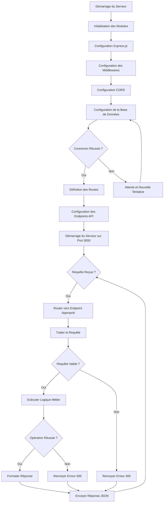

# BPMN - Service API SIG

## Diagramme BPMN

## Description des Activités

### 1. Initialisation du Serveur
- **Configuration Express.js**:
  - Initialisation de l'application Express
  - Configuration des paramètres serveur
  
- **Configuration des Middlewares**:
  - Configuration de Helmet pour la sécurité
  - Configuration de Morgan pour le logging
  - Configuration du parsing JSON

- **Configuration CORS**:
  - Définition des origines autorisées
  - Configuration des méthodes HTTP autorisées

- **Configuration de la Base de Données**:
  - Connexion à TimescaleDB
  - Connexion à PostgreSQL (alertes)
  - Vérification de l'état des connexions

### 2. Définition des Routes
- **Endpoints GET**:
  - `/health`: Vérification de l'état du service
  - `/api/capteurs`: Données des capteurs avec géolocalisation
  - `/api/satellite`: Observations satellitaires
  - `/api/predictions`: Prédictions du modèle
  - `/api/alertes`: Alertes actives avec filtrage
  - `/api/stats`: Statistiques agrégées

### 3. Traitement des Requêtes
- **Validation des Requêtes**:
  - Vérification des paramètres
  - Validation des formats de données
  
- **Exécution de la Logique Métier**:
  - Requêtes à la base de données
  - Transformation des données
  - Agrégation des résultats

- **Formatage des Réponses**:
  - Conversion en GeoJSON pour les données spatiales
  - Formatage JSON standard
  - Ajout des en-têtes appropriés

### 4. Gestion des Erreurs
- **Erreurs de Validation**:
  - Codes 400 pour les requêtes invalides
  
- **Erreurs Serveur**:
  - Codes 500 pour les erreurs internes
  - Journalisation des erreurs
  
- **Erreurs de Base de Données**:
  - Gestion des timeouts
  - Gestion des connexions perdues

## Points de Décision

1. **Connexion Réussie à la Base de Données**:
   - Si oui: continuer avec la définition des routes
   - Si non: attendre et retenter la connexion

2. **Requête Valide**:
   - Si oui: exécuter la logique métier
   - Si non: renvoyer une erreur 400

3. **Opération Réussie**:
   - Si oui: formater et envoyer la réponse
   - Si non: renvoyer une erreur 500

## Événements
- **Démarrage**: Lancement du service API
- **Requête Entrante**: Réception d'une requête HTTP
- **Réponse Sortante**: Envoi d'une réponse HTTP
- **Erreurs**: Problèmes de traitement des requêtes

## Annotations
- Le service écoute en permanence sur le port 3000
- Toutes les réponses sont au format JSON
- Les données spatiales sont retournées au format GeoJSON
- Le service inclut des middlewares de sécurité et de logging