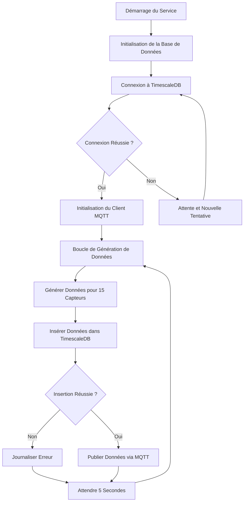

# BPMN - Service Capteurs

## Diagramme BPMN

## Description des Activités

### 1. Initialisation du Service
- Chargement des configurations
- Configuration des connexions de base de données
- Configuration du client MQTT

### 2. Boucle Principale de Génération de Données
- **Générer Données pour 15 Capteurs**:
  - Simulation de valeurs de pH (6.0-9.0)
  - Simulation de température (15-35°C)
  - Simulation de turbidité (0-10 NTU)
  - Assignation aléatoire à 8 zones géographiques

- **Insérer Données dans TimescaleDB**:
  - Connexion à la base de données
  - Préparation de la requête d'insertion
  - Exécution de l'insertion
  - Gestion des erreurs

- **Publier Données via MQTT**:
  - Formatage des données en JSON
  - Publication sur le sujet `capteurs/data`
  - Gestion des erreurs de publication

### 3. Gestion des Erreurs
- Journalisation des erreurs de base de données
- Journalisation des erreurs MQTT
- Tentatives de reconnexion automatiques

## Points de Décision

1. **Connexion Réussie à la Base de Données**:
   - Si oui: continuer avec l'initialisation MQTT
   - Si non: attendre et retenter la connexion

2. **Insertion Réussie dans la Base de Données**:
   - Si oui: publier les données via MQTT
   - Si non: journaliser l'erreur et attendre

## Événements
- **Démarrage**: Lancement du service
- **Fin**: Service arrêté (normalement jamais atteint dans la boucle infinie)
- **Erreurs**: Problèmes de connexion ou d'insertion

## Annotations
- Le service s'exécute en continu toutes les 5 secondes
- Toutes les erreurs sont journalisées mais ne stoppent pas le service
- Les données sont persistantes dans TimescaleDB et diffusées via MQTT