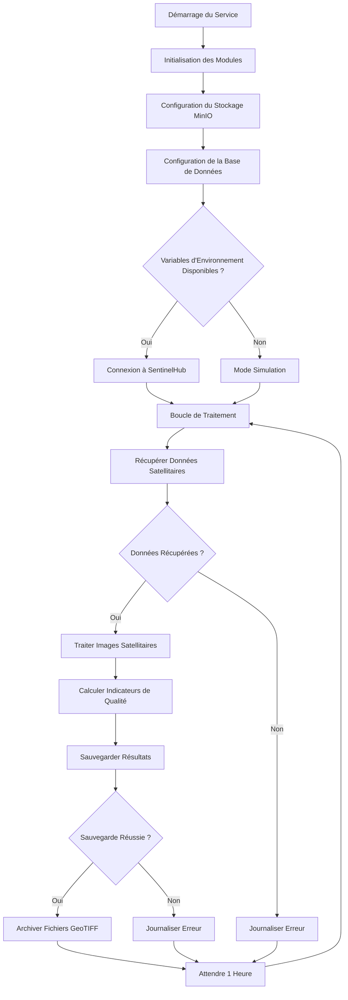

# BPMN - Service Satellite

## Diagramme BPMN

## Description des Activités

### 1. Initialisation du Service
- **Configuration du Stockage MinIO**:
  - Connexion au service de stockage d'objets
  - Vérification de l'accessibilité du bucket
  - Configuration des identifiants d'accès
  
- **Configuration de la Base de Données**:
  - Connexion à TimescaleDB pour stocker les métadonnées
  - Vérification de l'état de la connexion
  
- **Vérification des Variables d'Environnement**:
  - Recherche de SENTINEL_CLIENT_ID et SENTINEL_CLIENT_SECRET
  - Détermination du mode d'opération (réel ou simulation)

### 2. Modes d'Opération
- **Mode Réel (SentinelHub)**:
  - Connexion à l'API SentinelHub
  - Authentification avec les identifiants fournis
  - Récupération d'images Sentinel-2 réelles
  
- **Mode Simulation**:
  - Génération de données synthétiques
  - Création d'images simulées basées sur les zones du projet
  - Utilisation de valeurs représentatives pour les indicateurs

### 3. Boucle de Traitement Principale
- **Récupérer Données Satellitaires**:
  - Dans le mode réel: requête à l'API SentinelHub
  - Dans le mode simulation: génération de données synthétiques
  - Spécification de la zone d'intérêt (Rabat-Salé)
  - Définition de la période temporelle (dernières 24h)

- **Traiter Images Satellitaires**:
  - Chargement des images en mémoire
  - Application de corrections radiométriques
  - Extraction des bandes spectrales pertinentes
  - Conversion en formats d'analyse appropriés

- **Calculer Indicateurs de Qualité**:
  - **NDWI (Normalized Difference Water Index)**:
    - Calcul pour détecter les surfaces aquatiques
    - Formule: (Green - NIR) / (Green + NIR)
    - Identification des zones d'eau et de stress hydrique
    
  - **Turbidité**:
    - Estimation basée sur les bandes rouge et verte
    - Corrélation avec les concentrations de particules en suspension
    - Échelle de 0-10 NTU
    
  - **Chlorophylle**:
    - Estimation basée sur les bandes rouge et proche infrarouge
    - Indicateur de la prolifération d'algues
    - Échelle de 0-20 mg/m³

- **Sauvegarder Résultats**:
  - Insertion des indicateurs calculés dans TimescaleDB
  - Association avec les timestamps et coordonnées géographiques
  - Mise à jour des statistiques agrégées

- **Archiver Fichiers GeoTIFF**:
  - Conversion des images traitées en format GeoTIFF
  - Téléchargement vers le stockage MinIO
  - Association des métadonnées avec les fichiers

### 4. Gestion des Erreurs
- **Erreurs de Connexion SentinelHub**:
  - Vérification des identifiants
  - Journalisation des erreurs d'authentification
  - Retour au mode simulation si nécessaire
  
- **Erreurs de Traitement d'Images**:
  - Gestion des fichiers corrompus
  - Journalisation des erreurs de calcul
  - Continuation avec les données suivantes
  
- **Erreurs de Sauvegarde**:
  - Gestion des problèmes de base de données
  - Tentatives de réinsertion
  - Journalisation des échecs

## Points de Décision

1. **Variables d'Environnement Disponibles**:
   - Si oui: tenter la connexion à SentinelHub
   - Si non: passer en mode simulation

2. **Données Récupérées**:
   - Si oui: continuer avec le traitement
   - Si non: journaliser l'erreur et attendre

3. **Sauvegarde Réussie**:
   - Si oui: archiver les fichiers GeoTIFF
   - Si non: journaliser l'erreur

## Événements
- **Démarrage**: Lancement du service satellite
- **Connexion SentinelHub**: Authentification réussie
- **Données Récupérées**: Images satellitaires disponibles
- **Indicateurs Calculés**: Qualité de l'eau dérivée
- **Résultats Sauvegardés**: Données stockées en base
- **Fichiers Archivés**: GeoTIFFs stockés dans MinIO
- **Erreurs**: Problèmes de traitement ou de connexion

## Annotations
- Le service s'exécute toutes les heures pour une utilisation optimale des ressources
- Le mode simulation permet un fonctionnement sans identifiants SentinelHub
- Les indicateurs calculés sont stockés dans TimescaleDB pour l'analyse
- Les images brutes et traitées sont archivées dans MinIO
- Le service peut basculer entre les modes réel et simulation