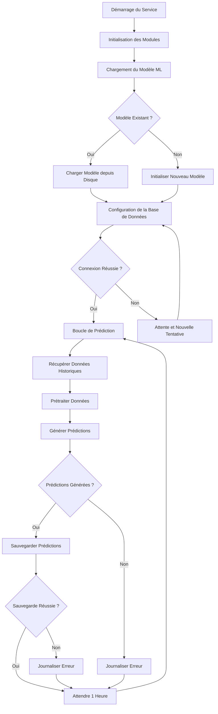

# BPMN - Service Modèle Spatio-Temporel

## Diagramme BPMN

## Description des Activités

### 1. Initialisation du Service
- **Chargement du Modèle ML**:
  - Vérification de la présence d'un modèle pré-entraîné
  - Chargement du modèle depuis le système de fichiers
  - Initialisation des poids et paramètres du modèle
  
- **Initialisation du Nouveau Modèle**:
  - Création d'une architecture ConvLSTM de base
  - Initialisation aléatoire des poids
  - Configuration des hyperparamètres par défaut
  
- **Configuration de la Base de Données**:
  - Connexion à TimescaleDB pour les données d'entraînement
  - Connexion à TimescaleDB pour stocker les prédictions
  - Vérification de l'état des connexions

### 2. Architecture du Modèle
- **Réseau Neuronal ConvLSTM**:
  - Couches de convolution pour l'extraction de caractéristiques spatiales
  - Couches LSTM pour la modélisation des dépendances temporelles
  - Couches denses pour la sortie de prédiction
  - Fonction d'activation ReLU pour les couches cachées
  - Fonction d'activation linéaire pour la sortie

- **Ingénierie des Caractéristiques**:
  - Agrégation des données de capteurs par zone géographique
  - Fenêtres temporelles de 24 heures pour l'entraînement
  - Normalisation des valeurs pour l'entraînement
  - Encodage des variables météorologiques (simulation)

### 3. Boucle de Prédiction Principale
- **Récupérer Données Historiques**:
  - Requête à TimescaleDB pour les données des 7 derniers jours
  - Agrégation par capteur et par heure
  - Organisation des données en séquences temporelles
  
- **Prétraiter Données**:
  - Nettoyage des valeurs aberrantes
  - Imputation des valeurs manquantes
  - Normalisation des caractéristiques
  - Division en ensembles d'entraînement et de validation
  
- **Générer Prédictions**:
  - Prédictions à 24 heures (à court terme)
  - Prédictions à 72 heures (à moyen terme)
  - Calcul des intervalles de confiance
  - Génération de scores de fiabilité
  
- **Types de Prédictions**:
  - **pH**: Prédiction de la valeur future du pH
  - **Température**: Prédiction de la température de l'eau
  - **Turbidité**: Prédiction des niveaux de turbidité
  - **Chlorophylle**: Prédiction des concentrations de chlorophylle

### 4. Stockage des Résultats
- **Sauvegarder Prédictions**:
  - Insertion des prédictions dans TimescaleDB
  - Association avec les timestamps de prédiction
  - Stockage des intervalles de confiance
  - Mise à jour des statistiques de performance
  
- **Métadonnées des Prédictions**:
  - Horodatage de la génération
  - Horodatage de la prédiction cible
  - Zone géographique concernée
  - Scores de confiance associés

### 5. Processus d'Entraînement (Simulation)
- **Dans l'Implémentation Actuelle**:
  - Le modèle utilise des poids prédéfinis pour la démonstration
  - L'entraînement est simulé pour des raisons de ressources
  - Les performances sont limitées par la nature simulée
  
- **Processus d'Entraînement Complet**:
  - Collecte de données historiques étendues
  - Entraînement supervisé avec vrais labels
  - Validation croisée pour éviter le surajustement
  - Ajustement des hyperparamètres

### 6. Gestion des Erreurs
- **Erreurs de Chargement du Modèle**:
  - Vérification de l'intégrité des fichiers
  - Initialisation d'un nouveau modèle si nécessaire
  - Journalisation des erreurs de chargement
  
- **Erreurs de Base de Données**:
  - Gestion des timeouts de connexion
  - Réessai des requêtes échouées
  - Journalisation des erreurs de requêtes
  
- **Erreurs de Prédiction**:
  - Gestion des entrées invalides
  - Journalisation des échecs de prédiction
  - Continuation avec les données suivantes

## Points de Décision

1. **Modèle Existant**:
   - Si oui: charger le modèle depuis le disque
   - Si non: initialiser un nouveau modèle

2. **Connexion Réussie à la Base de Données**:
   - Si oui: commencer la boucle de prédiction
   - Si non: attendre et retenter la connexion

3. **Prédictions Générées**:
   - Si oui: sauvegarder les prédictions
   - Si non: journaliser l'erreur et attendre

4. **Sauvegarde Réussie**:
   - Si oui: attendre la prochaine itération
   - Si non: journaliser l'erreur

## Événements
- **Démarrage**: Lancement du service de modèle
- **Modèle Chargé**: Architecture ML prête
- **Données Historiques Récupérées**: Ensemble de données disponible
- **Prédictions Générées**: Résultats du modèle produits
- **Prédictions Sauvegardées**: Résultats stockés en base
- **Erreurs**: Problèmes de traitement ou de connexion

## Annotations
- Le service s'exécute toutes les heures pour des prédictions régulières
- Le modèle utilise une architecture ConvLSTM pour capturer les dépendances spatio-temporelles
- Les prédictions sont générées pour 24h et 72h à l'avance
- Les résultats incluent des intervalles de confiance pour évaluer la fiabilité
- Le service peut fonctionner avec un modèle simulé en l'absence de données d'entraînement réelles